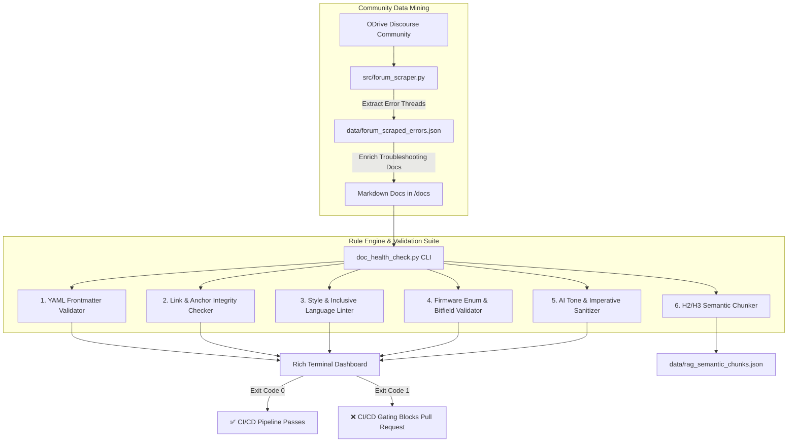

# ⚙️ ODrive API Docs
> **A Python-Powered Docs-as-Code Pipeline for Mechatronics & API Documentation**  
> *Automated Taxonomy Validation, Heading-Based Semantic Chunking, Inclusive Language Enforcement, and Community Knowledge Mining.*

---

## 📌 Executive Summary

Modern engineering teams deploy software and firmware at high velocity. In high-stakes hardware domains like robotics and motor control, documentation defects—such as inaccurate pinouts, unvalidated electrical parameters, broken anchor links, or confusing passive voice—directly cause physical hardware damage and stall developer onboarding.

This project delivers a production-grade **Python Content Operations (ContentOps)** pipeline tailored for the **ODrive Robotics API Reference**. It demonstrates how senior technical writers use Python not to build product features, but to build automated systems that govern, validate, and deploy technical documentation at scale.

---

## 🏗️ System Architecture



---

## ✍️ The 4 Tasks Technical Writers Code in Python

Modern technical writers operate at the intersection of information architecture, editorial governance, and software engineering. This suite addresses the four core Python applications:

| Discipline | Implementation in this Repository | Technical Writer's Impact |
| :--- | :--- | :--- |
| **1. Validation (Linters)** | `src/frontmatter_checker.py`<br>`src/style_linter.py`<br>`src/link_checker.py` | Automatically flags broken internal `#slug` anchors, missing YAML metadata, non-inclusive terminology (`master/slave` $\to$ `controller/target`), and weak verbs before PR merge. |
| **2. AI Tone & Sanitization** | `src/ai_sanitizer.py` | Integrates Gemini LLM APIs and heuristic engines to detect passive voice (*"The motor should be calibrated..."*) and generate concise imperative rewrites (*"Calibrate the motor..."*). |
| **3. Semantic Chunking (RAG)** | `src/chunker.py` | Slices documentation at logical conceptual boundaries (`H2`/`H3`) rather than arbitrary character counts, preserving task integrity, metadata, and citation URLs for AI search. |
| **4. Content Auditing & Scraping** | `src/forum_scraper.py` | Mines ODrive Discourse forums for real-world developer error codes (`ERROR_DRV_FAULT`, `ERROR_DC_BUS_OVER_VOLTAGE`) to transform support discussions into verified API documentation. |

---

## 🎯 Target Corpus: ODrive Robotics API Reference

This repository uses real-world mechatronics and motor control documentation as its testing corpus:

* **`axis_states.md`**: Finite State Machine (FSM) architecture, calibration workflows (`AXIS_STATE_FULL_CALIBRATION_SEQUENCE`), and closed-loop transitions.
* **`motor_configuration.md`**: Electrical parameters ($K_v$ to $K_t$ conversion, pole pairs, continuous phase current limits, and thermal throttling).
* **`can_protocol.md`**: CAN 2.0B / CAN-FD Simple Protocol, 11-bit arbitration ID bitfields (Node ID + Command ID), and cyclic telemetry broadcasting.
* **`troubleshooting_errors.md`**: Diagnostics catalog mapping hardware error bitfields, root causes, and community-verified solutions from ODrive engineering forums.
* **`fibre_rpc_api.md`**: Object tree reflection, native RPC communication, and endpoint hierarchies.

---

## 🚀 Quick Start Guide

### Prerequisites
* **Python 3.10+**
* `pip`

### 1. Installation
Clone the repository and install the lightweight dependencies:
```bash
git clone https://github.com/jengland555/odrive-api-docs.git
cd odrive-api-docs
pip install -r requirements.txt
```

### 2. Run the ContentOps Linter
Run health checks against the production documentation set:
```bash
python doc_health_check.py --path docs/valid/ --offline
```

### 3. Run Quality Gating on Flawed Docs
Test the linter against intentionally flawed documentation to observe defect detection:
```bash
python doc_health_check.py --path docs/invalid/ --offline
```

### 4. Auto-Remediate Style Violations (`--fix`)
Automatically correct non-inclusive terms and weak verbs in-place:
```bash
python doc_health_check.py --path docs/invalid/ --fix
```

### 5. Generate RAG Semantic Chunks (`H2`/`H3`)
Extract clean, heading-sliced semantic chunks ready for vector indexing:
```bash
python doc_health_check.py --chunk --path docs/valid/
```

### 6. Mine Community Forum Error Threads
Scrape and synthesize troubleshooting discussions from the ODrive Discourse community:
```bash
python doc_health_check.py --scrape-forum --offline
```

---

## 🖥️ Live Terminal Output Preview

```
┏━━━━━━━━━━━━━━━━━━━━━━━━━━━━━━━━━━━━━━━━━━━━━━━━━━━━━━━━━━━━━━━━━━━━━━━━┓
┃                            ODrive API Docs                             ┃
┃      Docs-as-Code Quality Gating, Style Enforcement & AI Tone Pipeline ┃
┗━━━━━━━━━━━━━━━━━━━━━━━━━━━━━━━━━━━━━━━━━━━━━━━━━━━━━━━━━━━━━━━━━━━━━━━━┛

🔍 Documentation Quality Findings
┏━━━━━━━━━━━━━━━━━━━━━━━━━━━━━┳━━━━━━┳━━━━━━━━━━┳━━━━━━━━━━━━━━━━━━━━━━━━┳━━━━━━━━━━━━━━━━━━━━━━━━━━━━━━━━━━━━━━━━━━━━━━┓
┃ File                        ┃ Line ┃ Severity ┃ Rule                   ┃ Message                                      ┃
┣━━━━━━━━━━━━━━━━━━━━━━━━━━━━━╋━━━━━━╋━━━━━━━━━━╋━━━━━━━━━━━━━━━━━━━━━━━━╋━━━━━━━━━━━━━━━━━━━━━━━━━━━━━━━━━━━━━━━━━━━━━━┫
┃ invalid/broken_can_guide.md ┃    6 ┃   WARN   ┃ frontmatter_invalid_...┃ Date 'invalid-date-format' must be YYYY-MM-DD ┃
┃ invalid/broken_can_guide.md ┃   11 ┃   WARN   ┃ weak_editorial_phrase  ┃ Found 'easy to use'. Use direct action.      ┃
┃ invalid/broken_can_guide.md ┃   13 ┃  ERROR   ┃ non_inclusive_language ┃ Found 'master-slave'. Use primary/secondary. ┃
┃ invalid/broken_can_guide.md ┃   15 ┃  ERROR   ┃ weak_editorial_phrase  ┃ Found 'click here'. Use descriptive link text┃
┃ invalid/broken_can_guide.md ┃   17 ┃   WARN   ┃ code_block_missing_lang┃ Code block missing syntax language specifier ┃
┃ invalid/unformatted_axis... ┃    1 ┃  ERROR   ┃ frontmatter_missing    ┃ Missing YAML frontmatter boundary at start.  ┃
┃ invalid/unformatted_axis... ┃    7 ┃  ERROR   ┃ broken_internal_anchor ┃ Broken local anchor '#nonexistent-anchor'.   ┃
┗━━━━━━━━━━━━━━━━━━━━━━━━━━━━━┻━━━━━━┻━━━━━━━━━━┻━━━━━━━━━━━━━━━━━━━━━━━━┻━━━━━━━━━━━━━━━━━━━━━━━━━━━━━━━━━━━━━━━━━━━━━━┛

┏━━━━━━━━━━━━━━━━━━━ 📊 Summary Metrics ━━━━━━━━━━━━━━━━━━━┓
┃ Files Scanned:  2                                        ┃
┃ Errors:         4                                        ┃
┃ Warnings:       3                                        ┃
┃ Execution Time: 0.04s                                    ┃
┗━━━━━━━━━━━━━━━━━━━━━━━━━━━━━━━━━━━━━━━━━━━━━━━━━━━━━━━━━━┛
┏━━━━━━━━━━━━━━━━━━━━━━━━━━━━━━━━━━━━━━━━━━━━━━━━━━━━━━━━━━┓
┃ ❌ FAIL: Documentation pipeline failed with 4 blocker(s). ┃
┗━━━━━━━━━━━━━━━━━━━━━━━━━━━━━━━━━━━━━━━━━━━━━━━━━━━━━━━━━━┛
```

---

## 📂 Project Structure

```
.
├── .github/
│   └── workflows/
│       └── doc-ci.yml                 # Automated CI/CD quality gating on PR & push
├── docs/
│   ├── valid/                         # Production-grade ODrive API reference docs
│   │   ├── axis_states.md             # State machine & calibration procedures
│   │   ├── motor_configuration.md     # Pole pairs, KV, torque constant, current limits
│   │   ├── can_protocol.md            # CAN 2.0B / CAN-FD arbitration & cyclic telemetry
│   │   ├── troubleshooting_errors.md  # Enriched with community forum error knowledge
│   │   └── fibre_rpc_api.md           # Object tree, RPC endpoints, Python bindings
│   └── invalid/                       # Test fixtures with injected real-world flaws
│       ├── broken_can_guide.md
│       └── unformatted_axis_doc.md
├── rules/
│   └── style_rules.json               # Configurable editorial rule dictionary
├── src/
│   ├── __init__.py
│   ├── frontmatter_checker.py         # YAML taxonomy & metadata validator
│   ├── link_checker.py                # Local anchor & HTTP link validator
│   ├── style_linter.py                # Inclusive language, weak verbs, heading hierarchy
│   ├── ai_sanitizer.py                # Gemini LLM prompt pipeline for voice/tone review
│   ├── chunker.py                     # Python H2/H3 Semantic Chunker (RAG-ready)
│   ├── forum_scraper.py               # ODrive Discourse scraper & error extractor
│   └── reporter.py                    # Rich terminal UI & JSON report generator
├── data/
│   ├── forum_scraped_errors.json      # Mined community error threads
│   └── rag_semantic_chunks.json       # Generated semantic chunks with metadata
├── doc_health_check.py                # Main CLI entrypoint
├── docs.html                          # Interactive API Reference documentation portal
├── requirements.txt                   # Project dependencies
└── README.md                          # Portfolio centerpiece documentation
```

---

## 👩‍💻 Author & Philosophy

**Jenna England**  
*Senior Technical Writer & Content Architect*  
* [LinkedIn](https://www.linkedin.com/in/jenna-england-0037b344/)  
* [GitHub](https://github.com/jengland555)  
* Portfolio Project 1: [Stripe AI Documentation Assistant & RAG Architecture](https://github.com/jengland555/stripe-ai-doc-assistant)

> *"Quality documentation is not an afterthought written at the end of a sprint—it is a critical software asset that must be tested, validated, and deployed with the same engineering rigor as application code."*

---

## 📄 License
Licensed under the [MIT License](LICENSE).
