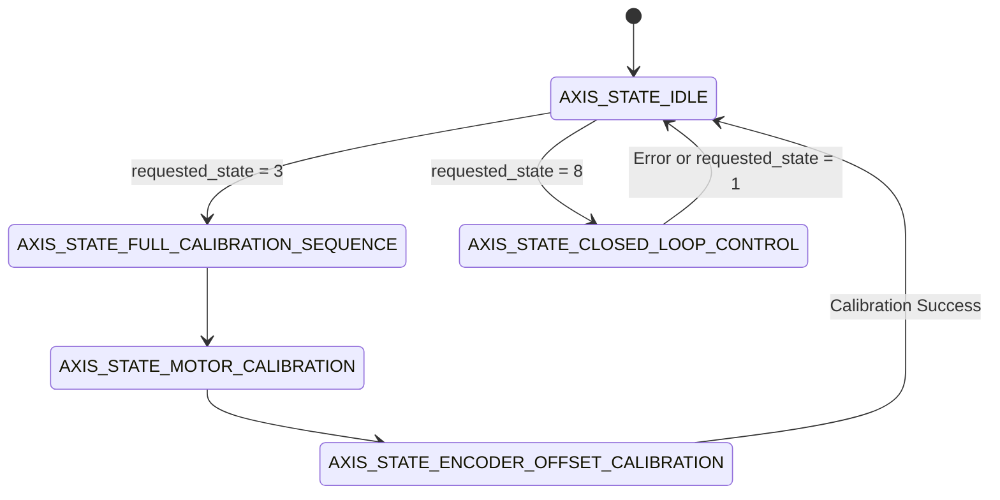

# ODrive Axis State Machine & Calibration Architecture

The ODrive controller manages high-performance brushless motor actuators using a deterministic, state-driven architecture. Each physical axis operates under an independent finite state machine (FSM) represented by `odrv0.axis0.current_state`.

---

## Axis State Hierarchy

The axis state machine transitions through predefined operational states. Understanding these states ensures safe motor commissioning and prevents mechanical shock during power-up.

### Idle and Calibration States

| State Enum | Integer Value | Description |
| :--- | :--- | :--- |
| `AXIS_STATE_UNDEFINED` | `0` | Axis state machine is uninitialized or in an indeterminate boot condition. |
| `AXIS_STATE_IDLE` | `1` | Motor PWM is disabled. MOSFET gates are floating; the rotor moves freely. |
| `AXIS_STATE_STARTUP_SEQUENCE` | `2` | Executes pre-configured boot routines configured in `axis.config.startup_*`. |
| `AXIS_STATE_FULL_CALIBRATION_SEQUENCE` | `3` | Sequentially executes motor electrical parameter checks and encoder offset calibration. |
| `AXIS_STATE_MOTOR_CALIBRATION` | `4` | Measures phase resistance and phase inductance by applying test currents. |
| `AXIS_STATE_ENCODER_OFFSET_CALIBRATION` | `7` | Rotates the rotor forward and backward to align encoder counts with rotor poles. |

### Operational Control States

| State Enum | Integer Value | Description |
| :--- | :--- | :--- |
| `AXIS_STATE_CLOSED_LOOP_CONTROL` | `8` | Enables Field-Oriented Control (FOC). Actively drives current, velocity, or position. |
| `AXIS_STATE_LOCKIN_SPIN` | `9` | Sensorless open-loop spin sequence for velocity ramping before sensorless takeover. |
| `AXIS_STATE_ENCODER_DIR_FIND` | `10` | Automatic direction search routine for incremental encoders without index pulses. |

---

## State Transition Workflow

To transition between states, write the target enum to `requested_state`. The state machine verifies preconditions before updating `current_state`.



---

## Commissioning Procedure

Follow this deterministic sequence when configuring a new motor and encoder assembly.

### Step 1: Run Full Motor and Encoder Calibration

Execute the calibration sequence using `odrivetool` or the Python API:

```python
import odrive
from odrive.enums import AXIS_STATE_FULL_CALIBRATION_SEQUENCE, AXIS_STATE_IDLE

odrv0 = odrive.find_any()
print(f"Connected to ODrive serial: {hex(odrv0.serial_number)}")

# Request full calibration
odrv0.axis0.requested_state = AXIS_STATE_FULL_CALIBRATION_SEQUENCE

# Wait for completion (axis returns to IDLE on success)
while odrv0.axis0.current_state != AXIS_STATE_IDLE:
    pass

print("Calibration complete. Checking error flags...")
if odrv0.axis0.error != 0:
    print(f"Calibration failed with error: {hex(odrv0.axis0.error)}")
```

### Step 2: Persist Calibration Data

To avoid repeating the mechanical calibration sequence on every power cycle, mark the configuration as pre-calibrated and save to NVM (Non-Volatile Memory):

```python
odrv0.axis0.motor.config.pre_calibrated = True
odrv0.axis0.encoder.config.pre_calibrated = True
odrv0.save_configuration()
print("Calibration persisted to NVM successfully.")
```

### Step 3: Enter Closed Loop Control

Once calibrated and persisted, command the axis into active closed-loop regulation:

```python
from odrive.enums import AXIS_STATE_CLOSED_LOOP_CONTROL

odrv0.axis0.requested_state = AXIS_STATE_CLOSED_LOOP_CONTROL
print(f"Current State: {odrv0.axis0.current_state}")  # Returns 8
```

---

## Error Handling and Recovery

When an electrical, thermal, or position limit is breached, the axis immediately drops out of closed-loop control and transitions to `AXIS_STATE_IDLE`.

### Diagnostics Protocol

Always inspect the four primary error registers before requesting state changes:

```python
def check_axis_health(axis):
    return {
        "axis_error": hex(axis.error),
        "motor_error": hex(axis.motor.error),
        "encoder_error": hex(axis.encoder.error),
        "controller_error": hex(axis.controller.error)
    }
```

### Error Reset Sequence

To clear non-fatal latched errors and re-arm the axis:

```python
odrv0.axis0.error = 0
odrv0.axis0.motor.error = 0
odrv0.axis0.encoder.error = 0
odrv0.axis0.controller.error = 0
odrv0.axis0.requested_state = AXIS_STATE_CLOSED_LOOP_CONTROL
```
