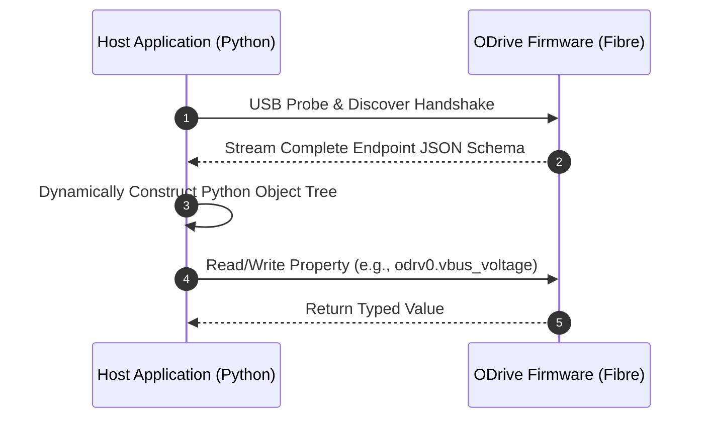

# Fibre Object Tree & Python Native RPC Interface

The ODrive Python SDK communicates with controller firmware over USB and UART using Fibre, a lightweight object-oriented Remote Procedure Call (RPC) framework.

---

## Fibre Reflection Model

Fibre provides dynamic schema discovery. When a client application connects, the ODrive exports a JSON reflection schema that details all available endpoints, functions, and variables supported by the current firmware version.



---

## Root Object Properties & Endpoints

Access properties on the root `odrv0` object through the instantiated Python connection.

### System Telemetry Properties

| Property | Type | Access | Description |
| :--- | :--- | :--- | :--- |
| `vbus_voltage` | `float32` | Read-Only | Current measured DC supply voltage on the power bus. |
| `ibus` | `float32` | Read-Only | Total instantaneous DC bus current drawn by both inverters. |
| `serial_number` | `uint64` | Read-Only | Unique 48-bit hardware identifier. |
| `hw_version_major` | `uint8` | Read-Only | Major printed circuit board hardware revision (e.g. 3 for v3.6). |
| `fw_version_major` | `uint8` | Read-Only | Major firmware release version. |

### Top-Level RPC Methods

Call these functions directly on the connected object:

```python
import odrive

# Discover and attach to the first available ODrive over USB
odrv0 = odrive.find_any()

# Read bus voltage
print(f"DC Bus Voltage: {odrv0.vbus_voltage:.2f} V")

# Persist all current settings to internal non-volatile memory
odrv0.save_configuration()

# Perform software reset and reboot micro-controller
odrv0.reboot()
```

---

## Axis Object Hierarchy

Each physical drive channel exposes an `axis` object containing sub-modules for current control, velocity regulation, and encoder tracking.

### Endpoint Address Hierarchy

```text
odrv0
├── axis0 / axis1
│   ├── config
│   ├── current_state
│   ├── requested_state
│   ├── error
│   ├── motor
│   │   ├── config
│   │   ├── current_control
│   │   └── is_calibrated
│   ├── encoder
│   │   ├── config
│   │   ├── pos_estimate
│   │   └── vel_estimate
│   └── controller
│       ├── config
│       ├── input_pos
│       └── input_vel
```

---

## High-Speed Telemetry Streaming with Fibre

To stream values at high rates without blocking the main event loop, leverage Fibre background polling:

```python
import time
import odrive

odrv0 = odrive.find_any()

print("Streaming encoder position at 50 Hz:")
try:
    while True:
        pos = odrv0.axis0.encoder.pos_estimate
        vel = odrv0.axis0.encoder.vel_estimate
        print(f"\rPosition: {pos:10.2f} turns | Velocity: {vel:10.2f} turns/s", end="")
        time.sleep(0.02)
except KeyboardInterrupt:
    print("\nTelemetry stream stopped by user.")
```
